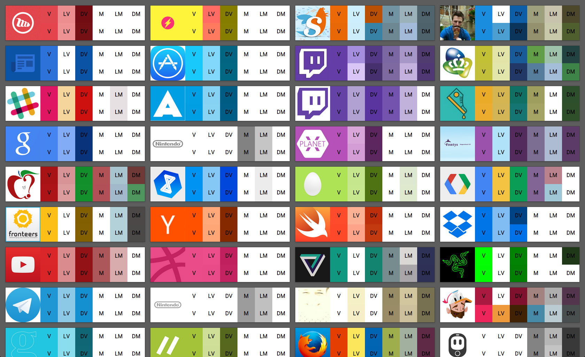

Demonstration
=============

The top row consists of the colors generated by the original library, the bottom row is generated by this JavaScript version.

Usage
=====
```js
var header = $('.header');
var avatar = header.find('img.avatar');
Palette
    .generate(avatar)
    .done(function(palette) {
        var vibrantColor = palette.getVibrantColor();
        if(vibrantColor !== null) {
            header.css('color', vibrantColor.toString());
        }
    }, function(error) {
        console.error(error);
    }
});
```

Issues
======
There are (about) three reasons this library doesn't completely match the Java version
- Images are scaled differently and colors might appear in different quantities
- The RGB to HSL conversion is different, and the code might behave differently in edge cases (i.e. a float on Android might be just above 1.0, while in JS it's cut off at 1)
- The PriorityQueues on both platforms behave differently. I translated most of the Java code, yet objects still don't get sorted the same 100% of the time. Any help on this would be greatly appreciated.

Acknowledgements
================
 - [Chris Banes](https://github.com/chrisbanes), author of the original Java-based library
